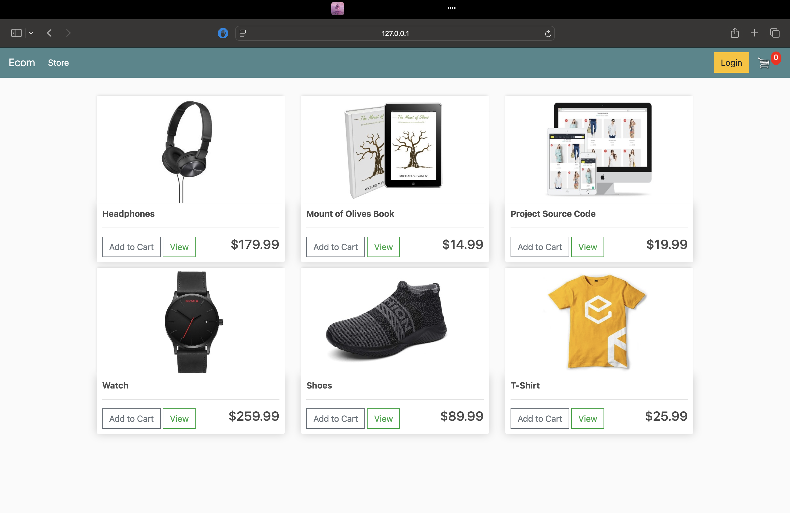
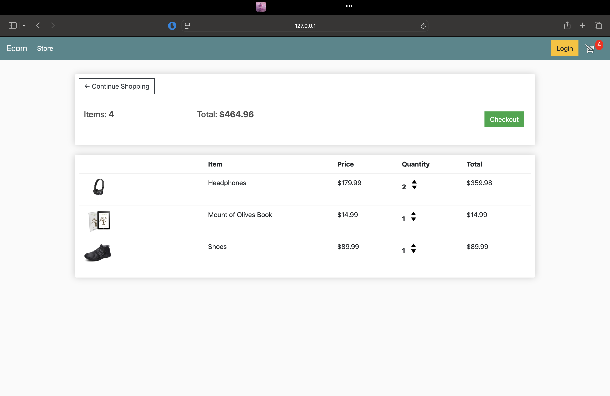
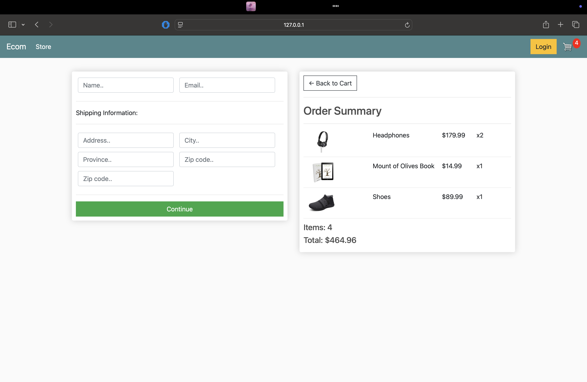

Ecommerce Django Project

Overview

This Ecommerce Django Project is a full-featured online store built to provide a seamless shopping experience. Designed with usability and responsiveness in mind, the platform allows users to browse products, manage carts, and complete secure checkouts effortlessly.

How It Works

The application offers several key features:
	•	User Authentication: Register and log in to manage orders and personalized settings.
	•	Product Browsing: View product listings and detailed pages with images and descriptions.
	•	Shopping Cart: Add, update, or remove items in a dynamic shopping cart before checkout.
	•	Checkout Process: Securely place orders and track purchase history.
	•	Admin Management: Backend dashboard for managing products, orders, and inventory.

How It Was Built

The project was developed using:
	•	Django framework for backend and templating
	•	SQLite database (default) with Django ORM
	•	HTML, CSS, and JavaScript for frontend interactivity
	•	Bootstrap for responsive design
	•	Git for version control

Interface

